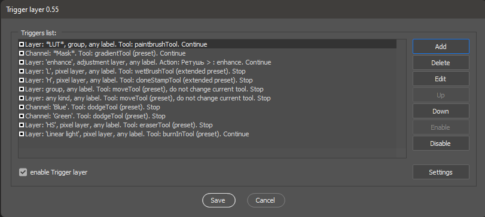
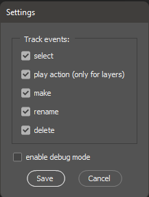
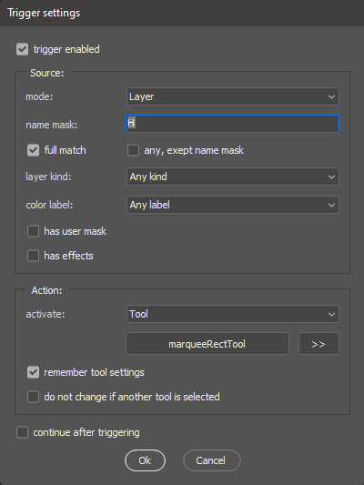
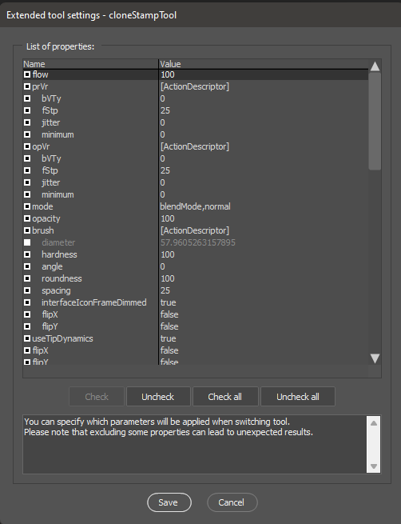

# Trigger layer

A script-based preset system that allows you to automatically launch a saved tool, action or another script, depending of the attributes of the selected layer.

## How to install:

1. Download latest version of [Trigger layer.jsx](Trigger%20layer.jsx) from GitHub repository [https://github.com/boogalooper/Trigger-layer]() 
2. Сopy Trigger layer.jsx to `Presets\Scripts\` folder of Photoshop
3. If Photoshop was open, restart it. The script will appear in the menu `File -> Automate`
4. Run script from menu and set up your triggers

## Main window:

The main window is a list of saved triggers. They can be added, edited, removed, moved up or down the list (triggers are executed in the order in which they were added), enabled or disabled.

## Settings window:

The script uses Photoshop's notification subsystem - every time you select a layer in layers palette, Photoshop calls `Trigger layer` and it decides what exactly needs to be done, depending on your triggers settings: activate the tool with certain settings, run an action, or run another script. In the settings window, you can set at what types of events Photoshop will activate the script. The debugging option is useful when checking the correct operation of the script - after each execution, the script will show a window indicating the trigger that fired. During normal operation, this option should be disabled.

The script stores all settings (including triggers) in a file:
WINDOWS: `~User\AppData\Roaming\Adobe\Adobe Photoshop (your version number)\Adobe Photoshop 2020 Settings\Trigger layer.desc`,
MACOS: `~Library/Preferences/Adobe Photoshop (your version number) Settings/Trigger layer.desc`
If you need to save or transfer script settings - just copy this file to a similar directory on another computer.

## Trigger window:

This window appears when adding or editing a trigger. In it, we must describe as accurately as possible the layer on which the script should work and indicate the necessary action.
The `trigger enabled` option temporarily disable or enable the trigger without deleting it from the triggers list. The option `continue after triggering` determines whether the following rules in the trigger list will be processed or the script will stop after firing.

#### Source:

You can use a `layer` or a `channel` (including mask channels) as the event source for a trigger.
In the `name mask` field, you can specify the name of the layer on which the script should work. With the `full match` option enabled, the trigger fires only if the layer name is identical to the entered text, with the option disabled, it is enough that the layer name contains the entered characters. The option `any, exept name mask`, inverts the mask (that is, the script will work on any layer that does not contain the specified characters).
For layers, you can use additional filtering options: select a specific `layer kind` from the list, a `color label`, `has mask`, `has effects` (including smart object effects), `has locking`.

#### Action:

Once the script has found the layer, it can do one of four actions:

1. activate the tool
2. launch the action
3. run another script (from the same directory where the Trigger layer.jsx itself is saved)
4. do nothing (bypass)

When the `tool` option is activated, the script offers to save the parameters of the current active tool. It can be changed by clicking on the tool name button.
If option `save instrument settings` selected, you can open the extended instrument settings window and specify which parameters the script will save (by default, when a trigger fires, the script restores all saved instrument settings, but you can turn off some of them - they will not be restored from settings, but will be taken from the current tool)

The option `do not change if another tool is selected` allows you to set an additional filter when the trigger fires. The tool settings will only be changed if it is already manually selected in the toolbar before the trigger is fired.

## Compability:

Tested on Photoshop CC2014 and newer

## Video example:

**Frequency decomposition.** Usually, the frequency decomposition is made by an action or a script with predefined layer names (for example, when I decompose into 2 frequencies - L - lower frequencies, H - upper ones). At lower frequencies, it is convenient for me to work with a mixing brush, and at higher frequencies with a stamp. Plus, it sometimes creates a layer-curve that enhances the upper frequencies (which I need to remove or turn off after retouching). With the help of a script and three triggers, you can minimize keyboard clicks by assigning the activation of the corresponding tools when selecting layers H and L, and also automatically delete the layer with adjustment curves:

**Separate layers and layers-groups.** In Photoshop, we often work with both individual layers and groups of layers. At the same time, if I select a group, then as a rule I want to move it entirely, and if I select a separate layer, then I want to move only it. It is clear that there is a checkbox “auto-select layer” and “auto-select group”, there is a transformation, but here and there you need to either click on the panel or use hotkeys, while literally a couple of triggers allow you not to touch anything except the mouse (watch out for the options with which the move tool is activated when selecting a layer and group after adding triggers)

**Layer masks.** Often, when working with layers that have masks, you have to work not with the contents of the layer, but with the mask itself. To switch to the mask, you need to make extra clicks. Using the script, you can make sure that when you select any layer with a mask, not the layer itself but the mask is activated. For complete happiness, you can add a trigger with your favorite tool (for example, a brush)

