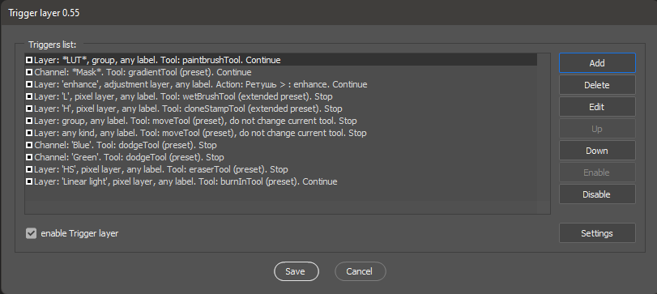
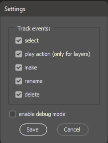
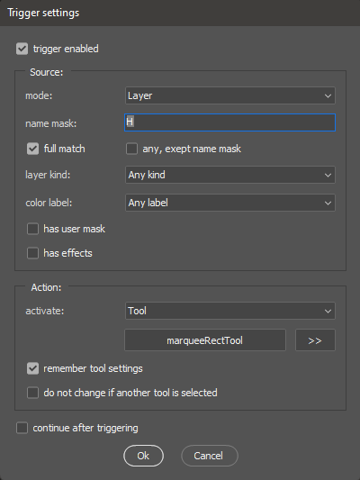
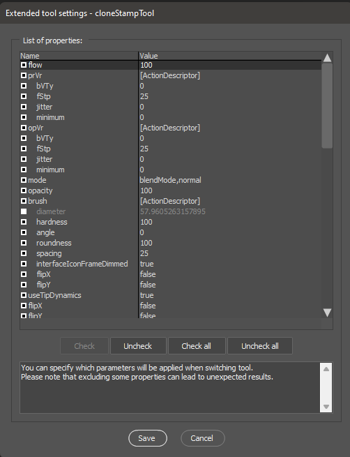

# Trigger layer

Cистема пресетов, которая позволяет автоматически запускать сохраненный инструмент, действие или другой сценарий, в зависимости от атрибутов выбранного слоя.

## Как установить:

1. Скачайте последнюю версию [Trigger layer.jsx](Trigger%20layer.jsx) из репозитория GitHub [https://github.com/boogalooper/Trigger-layer]() 
2. Скопируйте Trigger layer.jsx в папку `Presets\Scripts\` Photoshop
3. Перезапустите Photoshop, если он был запущен. Скрипт появится в меню `File -> Automate`
4. Запустите скрипт из меню `Automate` и настройте триггеры

## Главное окно:

Главное окно - это список сохраненных триггеров. Они могут быть добавлены, отредактированы, удалены, перемещены вверх или вниз по списку (триггеры выполняются в том порядке, в котором были добавлены), включены или отключены.

## Окно настроек:

Скрипт использует подсистему уведомлений Photoshop - каждый раз, когда вы выбираете слой в палитре слоев, Photoshop вызывает `Trigger layer`, и он решает, что именно нужно сделать, в зависимости от настроек триггеров: активировать инструмент с определенными настройками, запустить действие или другой скрипт. В окне «Настройки» вы можете установить, какие типы событий Photoshop могут активировать скрипт. Опция отладки полезна при проверке правильной работы ваших триггеров - после каждого срабатывания скрипте показывает окно с информацией о сработавшем триггере. Во время нормальной работы эта опция должна быть отключена.

Скрипт хранит все настройки (включая триггеры) в файле:
WINDOWS: `~User\AppData\Roaming\Adobe\Adobe Photoshop (your version number)\Adobe Photoshop 2020 Settings\Trigger layer.desc`,
MACOS: `~Library/Preferences/Adobe Photoshop (your version number) Settings/Trigger layer.desc`
Если вам нужно сохранить или перенести настройки скрипта - просто скопируйте этот файл в аналогичный каталог на другом компьютере.

## Окно триггера:

Это окно появляется при добавлении или редактировании триггера. В нем вы должны как можно точнее описать слой, на котором должен сработать скрипт и указать необходимое действие в случае его срабатывания. Опция `trigger enabled` позволяет временно выключить или включить триггер не удаляя его из списка. Опция `continue after triggering` определяет, будут ли обрабатываться следующие правила в списке триггеров или скрипт остановит работу после срабатывания.

#### Источник:

В качестве источника события для триггера вы можете использовать `layer` или `channel` (включая маски слоя).
В поле `name mask`, вы можете указать имя слоя, на котором должен сработать скрипт. С включенной опцией `full match` триггер сработает, только если имя слоя идентично введенному тексту. При отключенной опции, достаточно, чтобы имя слоя содержало введенные символы. Опция `any, exept name mask`, инвертирует маску поиска (то есть сценарий будет работать на любом слое, который не содержит указанные символы).
Для слоев вы можете использовать дополнительные параметры фильтрации: выбрать тип слоя из списка `layer kind`, `color label`, `has mask`, `has effects` (включая эффекты смарт-объетов), `has locking`.

#### Действие:

Как только скрипт нашел слой, он может выполнить одно из четырех действий:

1. Активировать инструмент
2. Запустить действие
3. Запустить другой сценарий (из того же каталога, где сохранен сам триггер).
4. Ничего не делать (байпасс)

Когда включена опция `tool`, скрипт предлагает сохранить параметры текущего активного инструмента. Его можно изменить, нажав на кнопку с названием инструмента.
Если активна опция `save instrument settings` то, вы можете открыть окно расширенных настроек инструмент и указать, какие параметры сохранит скрипт (по умолчанию, когда срабатывает триггер, скрипт восстанавливает все сохраненные настройки инструмента, но вы можете выключить некоторые из них - они не будут восстановлены из настроек, а будут взяты из текущего инструмента)

Опция `do not change if another tool is selected` позволяет установить дополнительный фильтр при срабатывании триггера - настройки инструмента будут изменены только, если он уже выбран вручную на панели инструментов до момента срабатывания триггера.

## Совместимость:

Скрипт протестирован на Photoshop CC2014 и новее.

## Видео примеры:

**Частотное разложение** Обычно частотку делают эшкеном или скриптом с заранее определенными именами слоев (например, у меня при разложении на 2 частоты - L - нижние частоты, H - верхние). На нижней частоте мне удобно работать миксирующей кистью, а на верхних частотах штампом. Плюс у меня иногда создает слой-кривая, усиливающая верхние частоты (который мне нужно удалить или выключить после окончания ретуши). При помощи скрипта и трех триггеров можно свести нажатия на клавиатуре к минимуму, назначив активацию соответствующих инструментов при выборе слоев H и L, а также автоматически удалять слой с корректирующими кривыми:

**Отдельные слои и слои-группы.** При сборке макетов часто приходится работать как с отдельными слоями, так и с группами слоев. При этом, если я выбираю группу, то как правило я хочу переместить ее целиком, а если выбираю отдельный слой - значит хочу переместить только его. Понятно, что есть галочка “авто-выбор слоя” и “авто-выбор группы”, есть трансформация, но там и там нужно либо клацать по панели, либо использовать хоткеи, при этом буквально пара триггеров позволяет не трогать ничего кроме мышки (следите за тем, с какими опциями активируется инструмент перемещения при выделении слоя и группы после добавления триггеров):

**Маски слоев** Часто, работая со слоями которые имеют маски, мы должны работать не со содержимым слоя, а с самой маской. Чтобы переключиться на маску, нам нужно делать дополнительные клики. Используя скрипт, при выборе такого слоя мы можем сразу активировать маску. Для полного счастья можно добавить триггер с подходящим любимым инструментом (например, кисть или градиент)

